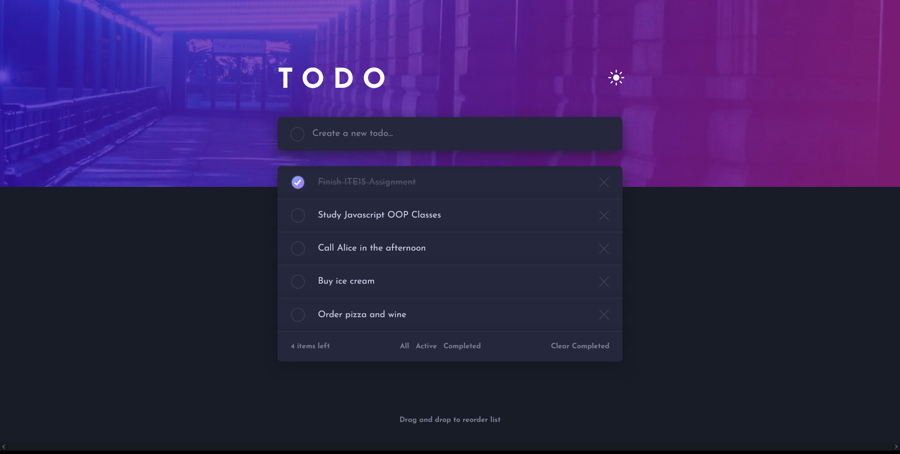

# Frontend Mentor - Todo app solution

This is a solution to the [Todo app challenge on Frontend Mentor](https://www.frontendmentor.io/challenges/todo-app-Su1_KokOW). Frontend Mentor challenges help you improve your coding skills by building realistic projects. 

## Table of contents

- [Overview](#overview)
  - [The challenge](#the-challenge)
  - [Screenshot](#screenshot)
  - [Links](#links)
- [My process](#my-process)
  - [Built with](#built-with)
  - [What I learned](#what-i-learned)
  - [Continued development](#continued-development)
- [Acknowledgments](#acknowledgments)

## Overview

### The challenge

Users should be able to:

- View the optimal layout for the app depending on their device's screen size
- See hover states for all interactive elements on the page
- Add new todos to the list
- Mark todos as complete
- Delete todos from the list
- Filter by all/active/complete todos
- Clear all completed todos
- Toggle light and dark mode
- Drag and drop to reorder items on the list

### Screenshot

### Links

- Live Site URL: [To-do Gen Live Site](https://todo-gen.netlify.app/)
- My Solution: [My To do app Solution || Frontend mentor](https://www.frontendmentor.io/solutions/desktop-first-approach-using-scss-and-vanilla-javascript-3RR0IPAUG)

## My process

### Built with

- BEM HTML5 markup with Emmet
- SCSS
- Flexbox
- Desktop-first workflow
- [Sortable.js](https://github.com/SortableJS/Sortable)

### What I learned

- I learned more DOM Manipulation methods in Javascript and used the classList API
- I combined data attributes and SCSS mixins to chaneg the colors by theme chosen by the user
- I used the Scrollable.js library for the drag and drop effect of every list item
- I learned how to build this project using Parcel
- I further practiced the fluid leyout for the responsive design of this project

### Continued development 

- The drag and drop functionality of this app could be improved by making it less sensitive when user would click the radio 
- I want to master the usage of data attributes and find out more about the things I could use it with
- I want to further my understanding of SCSS mixins and functions
- I want to be able to use more libraries for my future projects jsut like the implementation of the Scrollable.js in this one because it is really helpful and convenient

## Acknowledgments

This project is a challenge made by frontend mentor in this link [To do app Challenge || Frontend mentor](https://www.frontendmentor.io/challenges/todo-app-Su1_KokOW).

